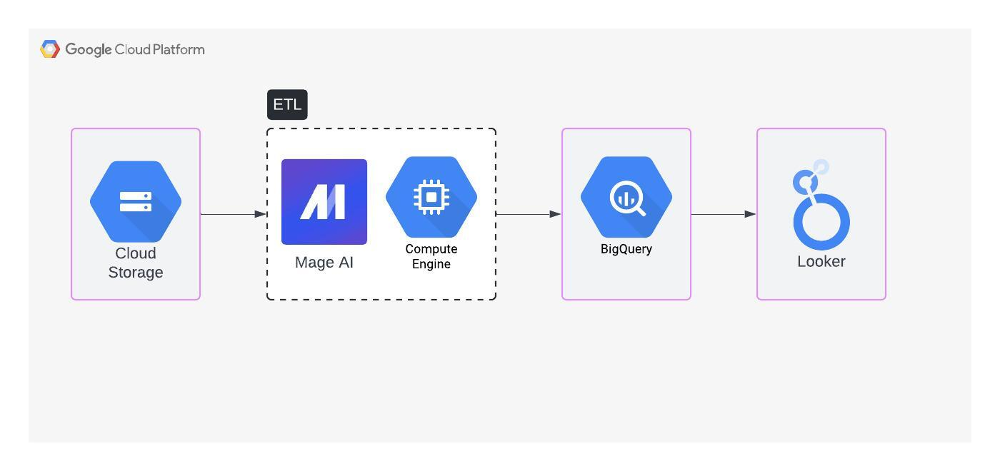
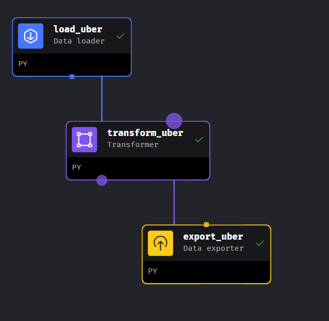
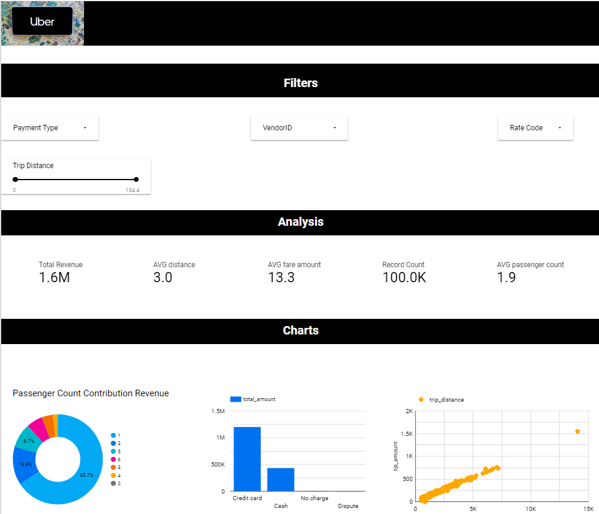

# 🚗 Uber Analytics - Google Cloud Platform

## Introduction
This document provides a comprehensive guide to analyzing an Uber dataset using a suite of data engineering and analytics tools. The focus will be on leveraging Mage AI for orchestrating and executing data pipelines, alongside Google Cloud Platform (GCP) technologies to store, process, and visualize the data.

## Architecture

## Technology Used
1. Programming Language: Python
2. Cloud: Google Cloud Platform
   - Google cloud storage
   - BigQuery
   - Looker Studio
3. Mage AI

## Dataset
The dataset consists of 100,000 entries, each representing a ride taken through the Uber platform. It contains 19 columns, capturing various details about each trip, such as:

> - VendorID: The ID of the vendor providing the trip.
> - tpep_pickup_datetime and tpep_dropoff_datetime: Timestamps for when the trip started and ended.
> - passenger_count: The number of passengers in the vehicle.
> - trip_distance: The distance traveled during the trip.
> - pickup_longitude and pickup_latitude: The geographic coordinates where the passenger was picked up.
> - RatecodeID: A code indicating the rate for the trip.
> - store_and_fwd_flag: A flag indicating if the trip record was held in the vehicle's memory before sending to the vendor due to a lack of connectivity.
> - dropoff_longitude and dropoff_latitude: The geographic coordinates where the passenger was dropped off.
> - payment_type: The method used for payment.
> - fare_amount, extra, mta_tax, tip_amount, tolls_amount, improvement_surcharge, and total_amount: Various financial details related to the fare.

This data will be analyzed to extract insights about trip patterns, fare distribution, and other key metrics using Mage AI for data orchestration, and Google Cloud Platform technologies for data storage, processing, and visualization.

dataset - https://github.com/hansolo-N/uber_analytics/blob/main/uber_data.csv

## Pipeline Mage AI

## Looker Studio Report

Report - https://lookerstudio.google.com/reporting/cceb3c57-d1ec-4aab-9dc9-905786b2b56d/page/MQl8D

